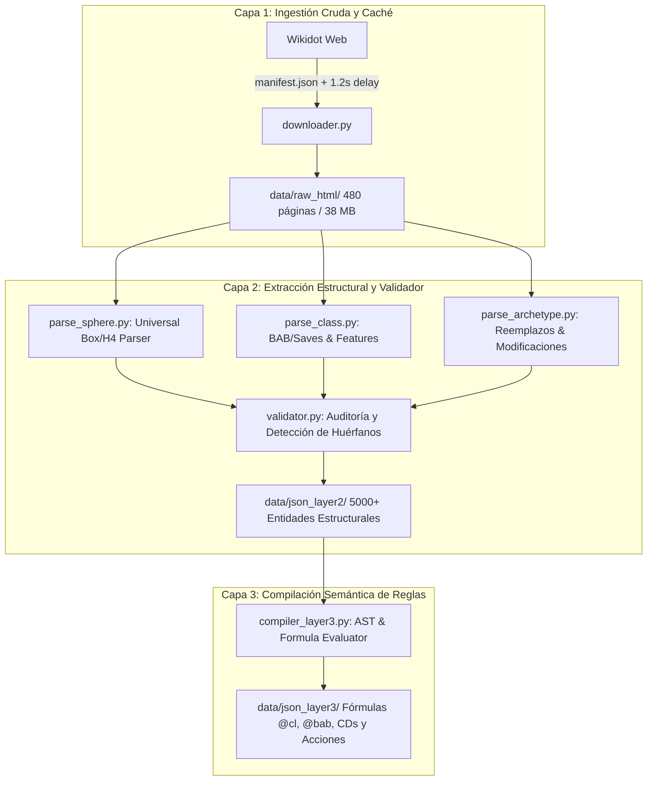

# 🧙 Spheres of Power & Might — Data Pipeline & Semantic Rule Compiler

[](https://python.org)
[]()
[]()
[](http://www.opengamingfoundation.org/ogl.html)

Pipeline de extracción, normalización y compilación semántica a JSON estructurado para todo el sistema de reglas de **Spheres of Power, Spheres of Might y Spheres of Guile** (TTRPG para Pathfinder 1e / D&D 5e) alojado en [spheresofpower.wikidot.com](http://spheresofpower.wikidot.com/).

---

## 🗺️ The Engineering Journey (Decisiones y Evolución)

Scrapear una wiki comunitaria de rol en Wikidot presenta desafíos de ingeniería particulares: la maquetación es heterogénea, hay enlaces cruzados circulares, y el lenguaje natural de los manuales expresa reglas matemáticas de decenas de formas diferentes. 

Para resolver esto sin depender de scrapers frágiles en tiempo real, diseñamos una **arquitectura desacoplada en 3 capas**:



### 1. Descubrimiento y Catálogo Maestro (`manifest.json`)
* **Problema:** Un crawler web recursivo genérico cae en bucles infinitos de foros, tags y páginas de sistema (`/system:recent-changes`, `/nav:side`).
* **Solución:** [`generate_manifest.py`](generate_manifest.py) analiza la estructura de columnas de la página principal e indexa un catálogo acotado y transparente de **480 URLs maestras**.

### 2. Capa 1: Ingestión Resiliente y Caché Local (`downloader.py`)
* **Problema:** Consultar la web en cada iteración de desarrollo satura los servidores y arriesga bloqueos de IP (HTTP 429/503).
* **Solución:** [`downloader.py`](downloader.py) descarga las 480 páginas con rate-limiting respetuoso (1.2s) a disco local (`data/raw_html/`). Una vez en caché, las lecturas toman **0 segundos**, permitiendo iterar los parsers offline a velocidad de SSD.

### 3. Capa 2: Extracción Estructural y el Patrón Validador (`validator.py`)
* **Problema:** Las esferas mágicas utilizan cajas con borde CSS (`border: 1px solid black`), mientras que las esferas de combate y habilidad utilizan encabezados `<h4>` libres y listas `<ul>`.
* **Solución:** [`parse_sphere.py`](parsers/parse_sphere.py) implementa un algoritmo universal híbrido. Además, [`validator.py`](parsers/validator.py) audita los JSONs comparando los encabezados HTML del archivo original con los talentos extraídos para detectar texto huérfano automáticamente.

### 4. Capa 3: Compilación Semántica a Motor de Reglas (`compiler_layer3.py`)
* **Problema:** En el código de un videojuego o VTT, un texto como *"deals 1d6 damage plus 1d6 per 2 caster levels beyond 1st"* no se puede evaluar si no está formalizado algebraicamente.
* **Solución:** [`compiler_layer3.py`](parsers/compiler_layer3.py) compila el lenguaje natural en variables computables (`@cl`, `@bab`, `@mod`, `@str`), economía de acciones (`standard`, `swift`, `free`) y fórmulas de tiradas de salvación (`10 + floor(@cl / 2) + @casting_mod`).

---

## 📊 Métricas del Dataset Extraído

| Entidad | Cantidad Extraída | Contenido Estructurado |
| :--- | :--- | :--- |
| **Esferas Mágicas, Combate y Habilidad** | **70 Esferas** | Reglas base, mecánicas, subtipos, fuentes y referencias cruzadas. |
| **Talentos de Esfera** | **5.052 Talentos** | Nombre limpio, tags (`[blast shape]`, `(body)`), sub-traits y descripción. |
| **Clases Base, Híbridas y Prestigio** | **58 Clases** | Dado de Golpe (HD), Rangos de habilidad, tabla de progresión 1–20 (BAB/Saves) y todos los rasgos de clase. |
| **Arquetipos** | **272 Arquetipos** | Clase base asociada, nuevos rasgos y cláusulas de reemplazo/modificación de habilidades. |
| **Talentos Enriquecidos (Capa 3)** | **2.057 Talentos** | Fórmulas matemáticas `@cl`, tipo de acción, rango evaluable y CDs. |

---

## 🌟 Ejemplo de Salida (Capa 3 — Game Engine Ready)

```json
{
  "name": "Destructive Blast",
  "raw_heading": "Destructive Blast",
  "tags": ["base_ability"],
  "source": "Core / Ultimate",
  "description": "As a standard action you may make a ranged touch attack dealing 1d6 damage plus 1d6 per 2 caster levels beyond 1st. Fortitude save negates. A target within close range...",
  "mechanics": {
    "action_cost": "standard",
    "range": {
      "type": "close",
      "formula": "25 + floor(@cl / 2) * 5"
    },
    "damage_formula": "1d6 + floor((@cl - 1) / 2)d6",
    "saving_throw": {
      "type": "fortitude",
      "effect": "negates",
      "dc_formula": "10 + floor(@cl / 2) + @casting_mod"
    }
  }
}
```

---

## 🚀 Guía de Ejecución

### 1. Requisitos
```bash
pip install requests beautifulsoup4
```

### 2. Generar Catálogo de URLs
```bash
python3 generate_manifest.py
```

### 3. Descargar Caché HTML (Capa 1)
```bash
# Descarga completa con rate-limiting
python3 downloader.py

# O descargar solo esferas
python3 downloader.py --category spheres
```

### 4. Ejecutar Parsers Estructurales (Capa 2)
```bash
# Parsear 70 esferas
python3 parsers/parse_sphere.py

# Parsear 58 clases
python3 parsers/parse_class.py

# Parsear 272 arquetipos
python3 parsers/parse_archetype.py

# Auditar calidad e integridad
python3 parsers/validator.py
```

### 5. Compilar Fórmulas Semánticas (Capa 3)
```bash
python3 parsers/compiler_layer3.py
```

---

## ⚖️ Licencia y Atribución
El contenido de reglas del sistema Spheres of Power / Spheres of Might pertenece a [Drop Dead Studios](http://spheresofpower.wikidot.com/) y está publicado bajo los términos de la **Open Game License (OGL) v1.0a**. Este software es una herramienta de ingeniería de datos y compilación de acceso libre para la comunidad TTRPG.
